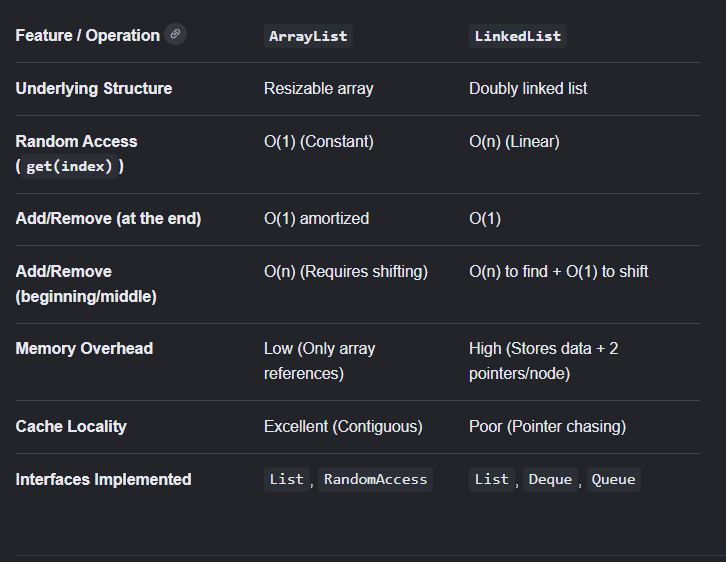

## ArrayList vs LinkedList Key Difference:
The main difference between ArrayList and LinkedList in Java is in it's underlying data structure and memory layout. Arraylist used resizable array storing data in contigous memory locations, which is useful in fast read access, while LinkedList uses doubly linkedlist structure while individual node objects are scattered all over the heap, making it efficient for additions/removal.

## Performance Comparison Matrix:

#### ArrayList
- Dynamic array implementation.
- Fast random access (`O(1)`).
- Slower insertions/deletions in middle (`O(n)`).
- Better cache locality.
- Lower memory overhead.

#### LinkedList
- Doubly linked list implementation.
- Slow random access (`O(n)`).
- Fast insertion/deletion once node is found.
- Higher memory overhead.
- Supports Queue and Deque operations directly.

## Internal Structure:

* ArrayList: When the array becomes full, it creates a new, larger array and copies the old elements using System.arraycopy().

* LinkedList: Each element is stored as a node with references to previous and next nodes.

## How operations work internally?

* Operation: Add to end
ArrayList: Fast
LinkedList: Fast

* Operation: Add to start
ArrayList: Slow
LinkedList: Fast

* Operation: Add to middle
ArrayList: Slow
LinkedList: Medium

* Operation: Get By Index
ArrayList: Fast
LinkedList: Slow

* Operation: Remove from end
ArrayList: Fast
LinkedList: Fast

* Operation: Remove from start
ArrayList: Slow
LinkedList: Fast

* Operation: Remove from middle
ArrayList: Slow
LinkedList: Medium

* Operation: Memory Overhead
ArrayList: Low
LinkedList: High

#### ArrayList Internal Implementation

1. Lazy Initialization & Capacity
* Lazy Initialization: When we create new ArrayList<>(), it creates an empty internal reference with no memory allocated to it until first element is inserted.
* Default Capacity: When the first element is inserted, array is allocated the default capacity of 10.

2. The resizing mechanism
When the size of the current array exceeds the size of backing array, the list resizes:
* JVM invokes an internal helper method grow()
* A new capacity is calculated using bitwise-right shift: old capacity + (old capacity >> 1). {Increasing the size of the backing array to 150% or by 50% of the original size}.
* A new list is created with the new capacity.
* Old list of values are copied from previous list to the new one with higher capacity using System.arrayCopy() and previous list is marked for garbage collection.

#### LinkedList Internal Implementation

* LinkedList consists of disconnected objects called Nodes. Nodes track three items: actual data, forward reference pointer and backward reference pointer. Nodes are scattered throughout the heap and are not placed adjacent or arranged sequentially, which is why memory overhead is high in LinkedList.

* In order to add or remove values, change the forward or backward reference pointer of the previous or next nodes as required. No data shifts happen.

## ----------------------------------------------------------- ##

