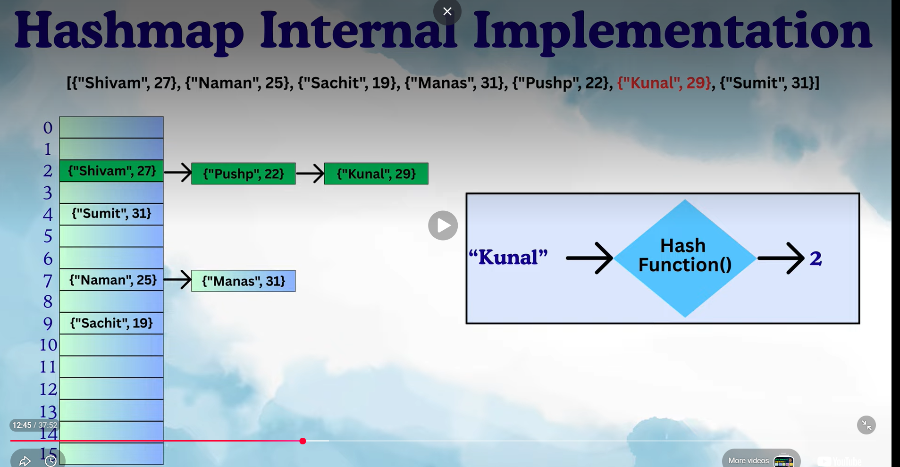

## HashMap internals — hashCode, equals, buckets

HashMap stores data in key-value pairs using a technique called hashing. Internally, it relies on an array of "Buckets". Each bucket holds a node - containing hash, key, value and reference to next node delivering O(1) average complexity for basic operations.

# Key Components:
1. Bucket Array - The foundational data structure. By default, a hashmap starts with a capacity of 16 buckets.
2. Node (Entries) - Each key-value pair is wrapped inside a node. A node contains key, value, hash code, and next pointer.
3. Hashing Function - When we insert a key, a method hashCode() of key is executed and it generates a hash code. A second hashing method then handles that the key-value pairs are evenly distributed across the buckets.

# The put() process (Insertion):
When we add a key-value pair, hashmap goes through the following steps:
1. Generates a hash Code for the key in key-value pair and this hash is mapped to a valid bucket index.
2. If the bucket is empty, a new node is created and placed at that index.
3. If collision occurs, 
If the keys are equal, checked using equals() method, then the value is updated to the new value.
If the keys are not equal, a reference is added to the existing node of the new pair in the form of a linked list.

* Before Java 8, the keys were chaining into linked list, which could lead to performance drop if there are too many elements in the linked list. From Java 8, once the linkedlist size passed the size threshold (usually 8 nodes) then the linkedlist is converted to a balanced binary search tree. (Treeification). This reduces the lookup complexity from O(n) to O(log n).

* One more point to notes is that, the actual node is not stored in the bucket array, the nodes are scattered throughout the memory and the address to the relevant node is stored at the allocated index.

# The get() process (Retreival):
When fetching a value by it's key:
1. The key generates a hash code and this hash code is compared to the hash codes of the bucket entries using equals().
2. If the hash code matches then the value is returned.
3. If not then it traverses the linkedlist or binary tree until the key-value pair is found.

## Dynamic resizing:
1. To prevent the bucket from getting too crowded (which increasses collisions and slows things down), hashmap keeps track of the load factor(0.75).
2. When the number of entries exceeds (Capacity * load factor) ( for example 16*0.75), the internal is resized.
3. During this resizing, the nodes are re-distributed by creating new hash code values into the newly resized bucket array.

Note: 
*** Rehashing is the process of automatically resizing a HashMap internal bucket array and redistributing the existing elements into this new, larger array ***

## Conversion of Hash Code to Index:

***    Index = HashCode & (N-1)    ***
How it works: If N = 16, then N - 1 = 15 (which is 00001111 in binary). Performing a bitwise & with this number automatically discards the higher bits and keeps only the lower bits, mapping any integer perfectly into the range of 0 to 15.

## For Reference (Theory Example): 

* Index 2 and Index 7 had collisions as the hash code generated for the keys were same, resulting it to form a linked list. Such collisions increases the fetch time complexity to O(n) from O(1).
* For visualization, pairs are displayed, but in reality addresses to the respective nodes containing the pairs are stored in this bucket array.

## ----------------------------------------------------------- ##

