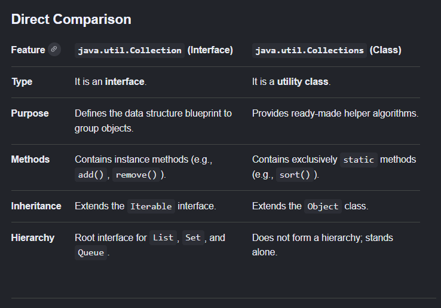
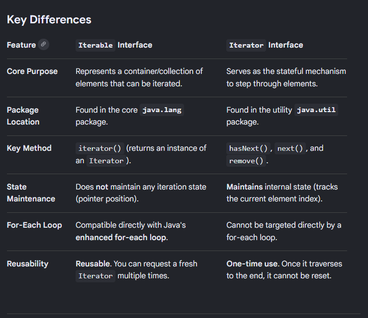
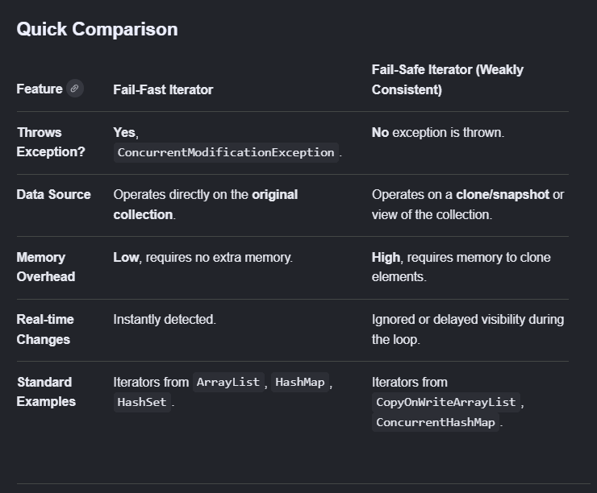
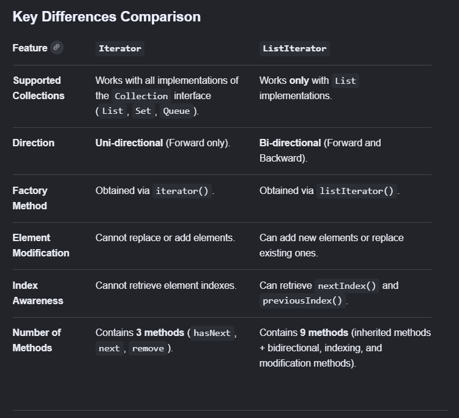
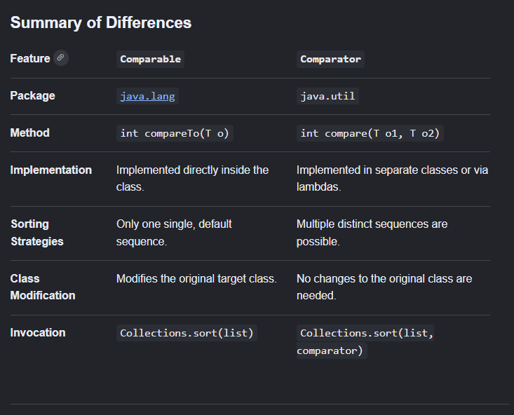

### Interview Questions

## Collections ##

1. What is the difference between Collection and Collections?

* Collection is an interface that represents a group of individual objects as a single unit while Collections is a utility class that provides static methods to operate on these collections or groups.

Collection Interface:
* Collection defines core fundamental data structure in Collections Framework. Interface cannot be directly used to instantiate so we use the implementing classes.

Sub-Interfaces: List, Set and Queue
Implementations: ArraList, HashSet, and LinkedList.

Collections Utility Class:
* The Collections utility acts strictly as a helper. It can be invoked directly through the class name without creating an object of the same because all of it's methods are static.

Key Algorithms: Sorting, searching, reversing, shuffling, and making collections thread-safe.Core 
Methods: Collections.sort(List l), Collections.reverse(List l), Collections.binarySearch(List l, T key), and Collections.shuffle(List l)

2. What is the difference between Iterable and Iterator?

Iterable represents a data structure that can be traversed using a forEach loop while iterator is the actual cursor tool used to perform that traversal.

* When to use which:
- Use iterable when a user normally wants to loop over each element easily using for loop syntax.
- Use iterator when you directly need to drop items using cursor.remove() in a loop which prevents ConcurrentModificationException.

3. Which collections are thread safe?

Vector, Hashtable, Stack — legacy thread safe classes
ConcurrentHashMap — thread safe HashMap
CopyOnWriteArrayList — thread safe ArrayList
Collections.synchronizedList() — wraps any list

4. What is fail-fast and fail-safe iterator?

Fail-fast: throws ConcurrentModificationException if collection is modified during iteration Examples: ArrayList, HashMap iterators
   
Fail-safe: works on a clone of collection. No exception if modified during iteration
Examples: ConcurrentHashMap, CopyOnWriteArrayList

5. Difference between Iterator and ListIterator?

Iterator: It iterates only in forward direction and works on all collections.
ListIterator: It iterates in both forward and backward direction and works on on List implementations.
ListIterator also has add() and set() methods.

# ------------------------------------------------------------- #

## ArrayList and LinkedList ##

1. What is the default initial capacity of ArrayList?

10

2. How does ArrayList grow internally when full?

When the number of elements exceed the current size of the list, the new array is created internally of 50% increase in the size of original capacity and all the elements from previous array is copied to the newly created array of new capacity.

oldCapacity + (oldCapacity >> 1) or new array of size = (oldCapacity * 1.5)

3. Why is LinkedList not recommended for frequent access?

LinkedList is a doubly linked list. In order to retrieve an element we need to traverse from the head, which makes the time complexity O(n) while arraylist on the other hand, uses index to fetch elements which reduces the complexity to O(1).

4. Can ArrayList store primitives?

No - ArrayList stores only Objects
   Primitives are autoboxed:
   int → Integer
   double → Double
   This autoboxing has a performance overhead

5. Difference between ArrayList and Vector?

Arraylist grows by 50% while vector grows by 100%. Arraylist is not thread safe while vector is thread safe (synchronized). Thread safety of vector makes it slow. It is better to use ArrayList + Synchronized set.

6. When would you use LinkedList over ArrayList?

When insertion and updation is to be done frequently in the beginning or middle of the list. Linkedlist has O(1) time complexity these operations while Arraylist has O(n).

## HashMap ## 

1. How does HashMap work internally?

Uses array of nodes. These nodes store key, value, hash and pointer to the next node. 
Key's hashcode determines buckets index.
Each bucket is a linkedlist.

2. What happens when two keys have same hashcode?

Collision occurs. In order to resolve this collision, a linked list is created at the same index (or within the same bucket).

3. What is the default load factor of HashMap?

0.75

Means when 75% of the hashmap is filled, hashmap resizes (doubles) and rehashes (distributes all the elements in the array again).

4. Why should we override hashCode with equals?

If two objects are equal (equals() returns true). If they are equal, they MUST have same hashcode, if not then it will store the objects in different buckets and treats them as different keys.

5. When would you use TreeMap over a HashMap?

When you need keys in sorted order.
When you need range operations: subMap(), headMap(), tailMap()
When you need first/last key: firstKey(), lastKey().

6. What is the time complexity of TreeMap operations?

get(), put(), remove(), containsKey(): O(log n)
Because TreeMap uses Red-Black Tree internally.
HashMap same operations: O(1) average.

7. Difference between Comparable and Comparator?

Comparable defines the natural ordering of a class's own objects internally, while Comparator defines custom, external sorting logic.

* Code Examples:

Comparable Example (Internal Natural Order)-

import java.util.*;

class Student implements Comparable<Student> {
    int id;
    String name;

    public Student(int id, String name) {
        this.id = id;
        this.name = name;
    }

    // Compares 'this' object with the passed object
    @Override
    public int compareTo(Student other) {
        return Integer.compare(this.id, other.id); 
    }
}

Comparator Example (External Custom Orders) - 

import java.util.*;

class Student {
    int id;
    String name;

    public Student(int id, String name) {
        this.id = id;
        this.name = name;
    }
}

public class Main {
    public static void main(String[] args) {
        List<Student> students = new ArrayList<>();

        // Strategy A: Sort by Name using lambda expressions
        students.sort((s1, s2) -> s1.name.compareTo(s2.name));

        // Strategy B: Sort by ID using the built-in composition factory
        students.sort(Comparator.comparingInt(s -> s.id));
    }
}

## ----------------------------------------------------------- ##

