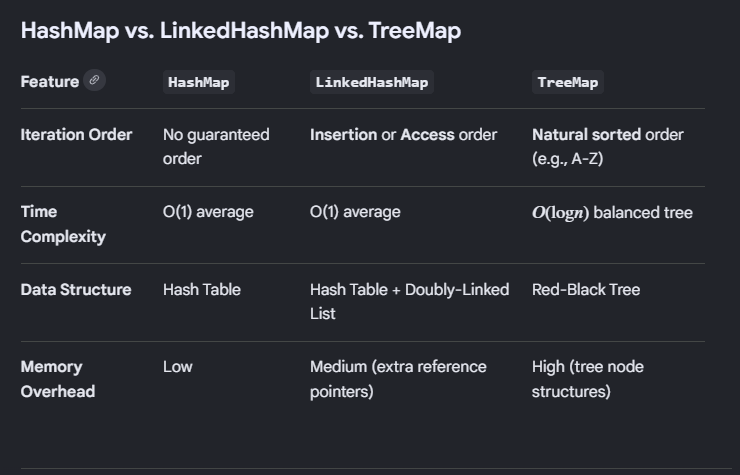

### LinkedHashMap

1. A LinkedHashMap class is a HashTable and doubly linked list implementation of the Map interface. It extends HashMap and maintains the insertion order.
2. It has null support. One null allowed for key and multiple for values.
3. O(1) constant time complexity for operations such as put, get, and remove.
4. Consumes more memory than hashmap because it maintains pointers to previous and next nodes.
5. Not Thread Safe. Can be made thread-safe using Collections.synchronizedMap().

## Internal Working

- A standard HashMap relies purely on hash buckets to place nodes, which scrambles element ordering during retrieval. 
- LinkedHashMap remedies this by keeping two underlying structures simultaneously:
1. The Hash Table: Inherited from HashMap to handle lightning-fast lookups.
2. A Doubly-Linked List: Connects all nodes together globally across the entire map via internal before and after pointers.

### TreeMap

- Collection class that stores key-value pairs in sorted order based on keys. It extends AbstractMap and implements NavigableMap and SortedMap interfaces.
- Automatically sorted based on keys.
- O(log n) is the time complexity for operations like put, get, remove and containsKey.
- It is backed by self-balancing Red-black Tree internally.
- Does not allow null key. Will throw null pointer exception but allows multiple null values.
- It is not thread-safe(synchronized). It can be made synchronized by using Collections.synchronizedSortedMap().

## HashMap vs LinkedHashMap vs TreeMap

