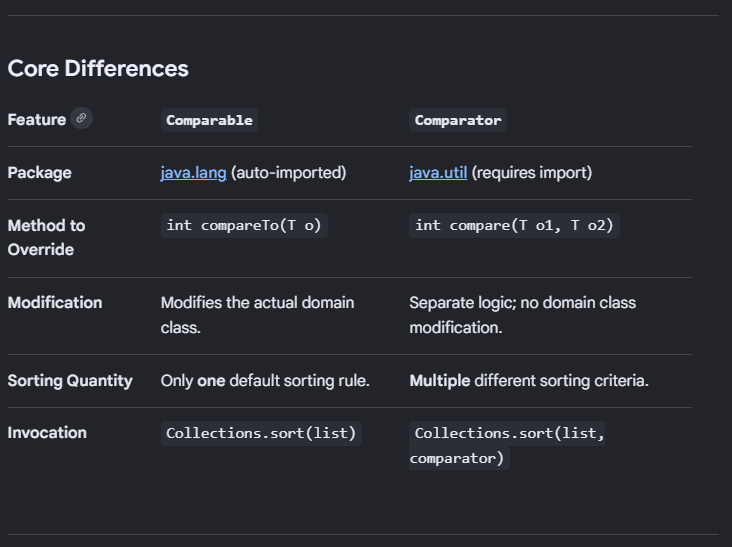

## Comparable-vs-Comparator

* In java, Comparable and Comparator both are interfaces used for sorting, they differ in how they implement sorting logic. Comparable defines the "natural" sorting order directly inside the target class while Comparator defines external, custom strategies that do not require altering the target class.

## Understanding Comparable

* The Comparable interface is implemented by class to give it's own instances a default sorting order (like alphabetical  order for Strings and ascending order for integerss).

* The contract for compareTo(T o):
- If *this* object is less than the argument, it returns negative integer.
- If *this* object is equal to the argument, it returns 0.
- If *this* object is greater than the argument, it returns positive integer.

# Implementation Example:

// Modifying the class itself to implement Comparable
class Student implements Comparable<Student> {
    private String name;
    private int age;

    public Student(String name, int age) {
        this.name = name;
        this.age = age;
    }

    public int getAge() { return age; }
    public String getName() { return name; }

    @Override
    public int compareTo(Student other) {
        // Natural sorting: ascending order by age
        return Integer.compare(this.age, other.age);
    }
}

# How to Sort?

List<Student> students = new ArrayList<>();
// ... add students ...
Collections.sort(students); // Automatically invokes compareTo()

# -------------------------------------------------------------------- #

## Understanding Comparator

* The Comparator interface is useful when you want to sort using secondary attributes (like sorting on name instead of age) or when you cannot modify the source code of the class.

* The Contract for compare(T o1, T o2):
- Returns a negative integer if o1 is smaller than o2.
- Returns zero if o1 is equal to o2.
- Returns a positive integer if o1 is greater than o2.

# Modern Implementations (Java 8+):
Since Comparator is a functional interface, you don't need to write separate bulky classes. Instead, you can use lambda expressions or built-in factory methods like Comparator.comparing().

// Method 1: Lambda Expression
Comparator<Student> nameComparator = (s1, s2) -> s1.getName().compareTo(s2.getName());

// Method 2: Method Reference (Highly Recommended for Cleanliness)
Comparator<Student> clearNameComparator = Comparator.comparing(Student::getName);

// Method 3: Chained Sorting (Sort by name, then by age if names are equal)
Comparator<Student> multiComparator = Comparator.comparing(Student::getName)
                                                .thenComparingInt(Student::getAge);

# How to Sort?

List<Student> students = new ArrayList<>();
// ... add students ...
Collections.sort(students, clearNameComparator); // Pass custom rules explicitly

# Key Takeaways for Code Design
- Implement Comparable when there is an obvious, global "natural order" for your entity.
- Choose Comparator when you need flexibility, need to supply multiple sorting views, or want to decouple your sorting rules from the data model entirely.

# ---------------------------------------------------------------------- #