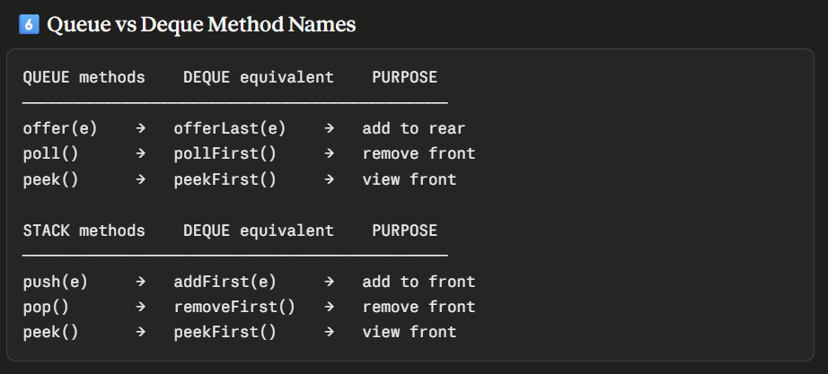

## Deque

Double Ended Queue
Pronounced "deck"

Can add/remove from BOTH ends:

FRONT                           REAR
  ↕                               ↕
[ ] [ ] [ ] [ ] [ ] [ ] [ ] [ ]

This makes Deque work as BOTH:
→ Stack (use front only)
→ Queue (add rear, remove front)

4️⃣ Deque Internal Implementation — ArrayDeque

Resizable circular array
Two pointers:
→ head (front index)
→ tail (rear index)

Initial capacity: 16
Growth: doubles when full

Initial state:
array:  [ ][ ][ ][ ][ ][ ][ ][ ]
index:   0  1  2  3  4  5  6  7
head=0, tail=0

* AddFirst (push to front)
addFirst(10):
array:  [ ][ ][ ][ ][ ][ ][ ][10]
                                ↑
                head moves to index 7
                (wraps around circularly!)
head=7, tail=0

addFirst(20):
array:  [ ][ ][ ][ ][ ][ ][20][10]
                            ↑
                           head=6

addFirst(30):
array:  [ ][ ][ ][ ][ ][30][20][10]
                         ↑
                        head=5

* AddLast (add to rear)
Current state:
array:  [ ][ ][ ][ ][ ][30][20][10]
head=5, tail=0

addLast(40):
array:  [40][ ][ ][ ][ ][30][20][10]
         ↑                ↑
        tail=1           head=5

addLast(50):
array:  [40][50][ ][ ][ ][30][20][10]
             ↑             ↑
            tail=2        head=5

* Visual of Circular Array
Think of array as a circle:

        [30]
    [20]    [40]
  [10]        [50]
    [ ]      [ ]
        [ ]

head and tail pointers move
around this circle!

# --------------------------------------------------------------------------------------- #

* My query: What does this mean Wraps around circularly when reaching array end?

🤔 The Problem Without Circular Behaviour:
Imagine a normal array of size 8:

Initial:
[10][20][30][40][ ][ ][ ][ ]
 ↑               ↑
head=0          tail=4

Now poll() three times (remove from front):
[ ][ ][ ][40][ ][ ][ ][ ]
          ↑    ↑
        head=3 tail=4

Now offer(50), offer(60), offer(70)...
keep adding to tail:
[ ][ ][ ][40][50][60][70][ ]
          ↑               ↑
        head=3           tail=7

Now offer(80):
[ ][ ][ ][40][50][60][70][80]
          ↑                ↑
        head=3           tail=8 ← PROBLEM!

tail has reached end of array
BUT there are 3 empty slots at the beginning!

Without circular behaviour:
❌ Array says FULL
❌ Those 3 empty slots are WASTED
❌ Need to resize unnecessarily

✅ With Circular Behaviour — The Fix:

Instead of stopping at the end
tail WRAPS AROUND to the beginning!

[ ][ ][ ][40][50][60][70][80]
 ↑        ↑
tail      head
wraps     =3
here!

offer(90) → tail wraps to index 0:
[90][ ][ ][40][50][60][70][80]
    ↑      ↑
   tail=1  head=3

offer(100) → tail moves to index 1:
[90][100][ ][40][50][60][70][80]
         ↑   ↑
        tail=2 head=3

offer(110) → tail moves to index 2:
[90][100][110][40][50][60][70][80]
              ↑
             head=3
NOW array is truly full! ✅

🔢 How Java Does This Mathematically:
java// Normal array movement:
tail = tail + 1      // just moves right
// Problem: stops at end!

// Circular array movement:
tail = (tail + 1) % capacity
// % is modulo operator

// Example with capacity = 8:
tail=5: (5+1) % 8 = 6  ✅ normal move
tail=6: (6+1) % 8 = 7  ✅ normal move
tail=7: (7+1) % 8 = 0  ✅ WRAPS to beginning!
tail=0: (0+1) % 8 = 1  ✅ continues normally

// Same for head:
head = (head - 1 + capacity) % capacity
// +capacity prevents negative numbers

* Circular array = when tail reaches the END
it wraps back to index 0 using % operator
so empty slots at beginning are reused
avoiding unnecessary resizing! 🎯

# --------------------------------------------------------------------------------------- #