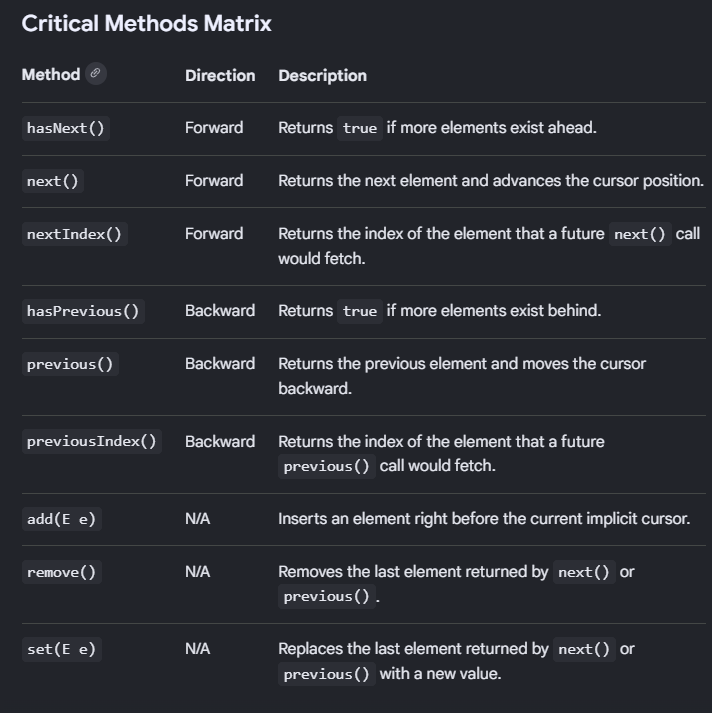

## Iterator

* An iterator is a core interface belonging to java.utils package that let's us traverse through the elements of the collection sequentially without exposing it's underlying structure.

The Java Iterator Interface documentations lists three primary methods:
1. hasNext() -> Returns true or false on whether there is any next element present in the array.
2. next() -> returns the next element and advances the pointer/cursor forwards.
3. remove() -> safely deletes the last element returned by the iterator from the collection

# Internal Implementation: How it works under the hood?

* Iterator is an interface, so every collection class provides it's own concrete, optimized inner class implementation of the iterator iterface.
* Example: ArrayList has a private inner class called "Itr".

public class ArrayList<E> {
    
    // the actual array
    Object[] elementData;
    int size;
    int modCount;  // ← very important!
    
    // returns iterator object
    public Iterator<E> iterator() {
        return new Itr();  // returns inner class
    }

    // inner class implementing Iterator
    private class Itr implements Iterator<E> {
        int cursor;      // next element index
        int lastRet = -1; // last returned index
        int expectedModCount = modCount; // ← key!
    }
}

📝 Three Key Fields Inside Itr

1. cursor
   → index of NEXT element to return
   → starts at 0
   → moves forward with each next() call

2. lastRet
   → index of LAST returned element
   → starts at -1 (nothing returned yet)
   → used by remove() to know what to delete

3. expectedModCount
   → copy of ArrayList's modCount at 
     time iterator was created
   → used for fail-fast detection!

# Internal Implementation for each method:

1. hasNext():

public boolean hasNext() {
    return cursor != size;
    // simply checks if cursor
    // has reached end of list
}

// Visual:
// list = [10, 20, 30]
// size = 3

// cursor=0: 0 != 3 → true  ✅
// cursor=1: 1 != 3 → true  ✅
// cursor=2: 2 != 3 → true  ✅
// cursor=3: 3 != 3 → false ❌ stop!

2. next():

public E next() {
    // STEP 1: check for modification
    checkForComodification();
    
    // STEP 2: validate cursor
    int i = cursor;
    if (i >= size)
        throw new NoSuchElementException();
    
    // STEP 3: get element
    Object[] elementData = ArrayList.this.elementData;
    cursor = i + 1;      // move cursor forward
    lastRet = i;         // remember last index
    return (E) elementData[lastRet];  // return element
}

// Visual:
// list = [10, 20, 30]
// 
// Call next():
// cursor=0 → returns elementData[0]=10
//            cursor becomes 1
//            lastRet becomes 0
//
// Call next():
// cursor=1 → returns elementData[1]=20
//            cursor becomes 2
//            lastRet becomes 1
//
// Call next():
// cursor=2 → returns elementData[2]=30
//            cursor becomes 3
//            lastRet becomes 2

3. remove():

public void remove() {
    // STEP 1: check lastRet valid
    if (lastRet < 0)
        throw new IllegalStateException();
    
    // STEP 2: check for modification
    checkForComodification();
    
    // STEP 3: remove element
    ArrayList.this.remove(lastRet);
    
    // STEP 4: update cursor and lastRet
    cursor = lastRet;   // cursor moves back
    lastRet = -1;       // reset lastRet
    
    // STEP 5: sync expectedModCount!
    expectedModCount = modCount;
}

// Visual:
// list = [10, 20, 30]
// after next() returns 20, lastRet=1
//
// remove():
// removes elementData[1] = 20
// list becomes [10, 30]
// cursor moves back to 1
// lastRet resets to -1

# Fail-Fast — The Most Important Part

* What is modCount?

// Inside ArrayList:
protected transient int modCount = 0;

// modCount increases on EVERY
// structural modification:
// add()    → modCount++
// remove() → modCount++
// clear()  → modCount++
// sort()   → modCount++

// Size changes = structural modification
// set()  does NOT increase modCount
// (value change, not structure change)

* checkForComodification()

final void checkForComodification() {
    if (modCount != expectedModCount)
        throw new ConcurrentModificationException();
}

// This is called in EVERY next() call!

* Fail-Fast Visual
// Create list and iterator:
List<Integer> list = new ArrayList<>();
list.add(10);
list.add(20);
list.add(30);
// modCount = 3

Iterator<Integer> it = list.iterator();
// expectedModCount = 3 ✅

it.next();  // returns 10
            // checks 3==3 ✅

// MODIFY list directly!
list.add(40);
// modCount becomes 4 ❌

it.next();  // checks 4==3 ❌
            // throws ConcurrentModificationException!

// WHY?
// Iterator expected list to have
// same structure as when it was created
// Direct modification broke that contract!

* Safe Way — Use Iterator's Own remove()

Iterator<Integer> it = list.iterator();
while (it.hasNext()) {
    int val = it.next();
    if (val == 20) {
        it.remove();  // ✅ SAFE!
        // updates expectedModCount internally
        // so no ConcurrentModificationException
    }
}

// NEVER do this inside iteration:
while (it.hasNext()) {
    int val = it.next();
    if (val == 20) {
        list.remove(val);  // ❌ UNSAFE!
        // modCount changes
        // expectedModCount not updated
        // ConcurrentModificationException!
    }
}

## Iterator vs ListIterator Internally

Iterator (Itr):              ListIterator (ListItr):
─────────────────────────────────────────────────────
cursor (forward only)        cursor (forward)
lastRet                      lastRet
expectedModCount             expectedModCount
                             + can go backwards!
                             uses cursor-1 for previous()

ListItr extends Itr:
private class ListItr 
    extends Itr
    implements ListIterator<E> {
    
    // adds backward traversal
    public boolean hasPrevious() {
        return cursor != 0;
    }
    
    public E previous() {
        checkForComodification();
        int i = cursor - 1;
        if (i < 0)
            throw new NoSuchElementException();
        cursor = i;
        lastRet = i;
        return (E) elementData[lastRet];
    }
}

## Iterators in Other Collections:

Collection          Iterator Inner Class
────────────────────────────────────────
ArrayList     →     Itr (array index based)
LinkedList    →     ListItr (node pointer based)
HashMap       →     HashIterator (bucket traversal)
HashSet       →     uses HashMap's iterator internally
TreeMap       →     PrivateEntryIterator (tree traversal)

Each has its OWN internal implementation
but ALL check modCount for fail-fast!

## ListIterator:

* ListIterator interface in JAVA is advanced cursor that allows us to traverse in both forward and backward direction. It extends Iterator interface, giving us more power to modify, add or remove elements safely during iteration.

Key Features of ListIterator:
* Bidirectional Traversal: You can step forward using next() or backward using previous().* Implicit Position: The cursor does not point to a specific element; it always rests between elements.
* Full CRUD Operations: Unlike a traditional Iterator, it allows you to append new elements via add() or modify elements via set() mid-loop.
* Limited Scope: It only works with List collections like ArrayList, LinkedList, and Vector.

## For-Each (The Enhanced For loop - Java 5+)

* This is a language-level construct used to iterate over arrays and classes that implement the Iterable interface. It provides syntactic sugar, meaning the Java compiler transforms it into standard code during compilation.

# Implementation for Collections
* When you use the enhanced for loop on a collection (like an ArrayList or HashSet), the compiler rewrites the loop to use a standard java.util.Iterator.

Actual Code:
List<String> list = Arrays.asList("A", "B", "C");
for (String item : list) {
    System.out.println(item);
}

Compiler's Internal Translation:
List<String> list = Arrays.asList("A", "B", "C");
Iterator<String> iterator = list.iterator();
while (iterator.hasNext()) {
    String item = iterator.next();
    System.out.println(item);
}

# Implementation for Arrays
* Because arrays do not implement Iterable, the compiler handles them differently by converting the loop into a traditional, index-based for loop.

Actual Code:
String[] array = {"A", "B", "C"};
for (String item : array) {
    System.out.println(item);
}

Compiler's Internal Translation:
String[] array = {"A", "B", "C"};
for (int i = 0; i < array.length; i++) {
    String item = array[i];
    System.out.println(item);
}

## The .forEach Method (Java 8+)

* This is an instance method defined inside the java.lang.Iterable interface.

* Core Interface Implementation:
The default implementation inside the Iterable interface itself uses the enhanced for loop.

default void forEach(Consumer<? super T> action) {
    Objects.requireNonNull(action);
    for (T t : this) { // Uses the Iterator mechanism described above
        action.accept(t);
    }
}

* Overridden Implementation (e.g., ArrayList)
To optimize performance, core collections override this default behavior. For example, ArrayList bypasses creating an Iterator object entirely. Instead, it uses a highly efficient, direct index-based internal loop over its underlying element array:

@Override
public void forEach(Consumer<? super E> action) {
    Objects.requireNonNull(action);
    final int expectedModCount = modCount;
    final E[] elementData = (E[]) this.elementData;
    final int size = this.size;
    
    for (int i=0; modCount == expectedModCount && i < size; i++) {
        action.accept(elementData[i]);
    }
    // Structural modification check
    if (modCount != expectedModCount) {
        throw new ConcurrentModificationException();
    }
}

# --------------------------------------------------------------------------------------- #