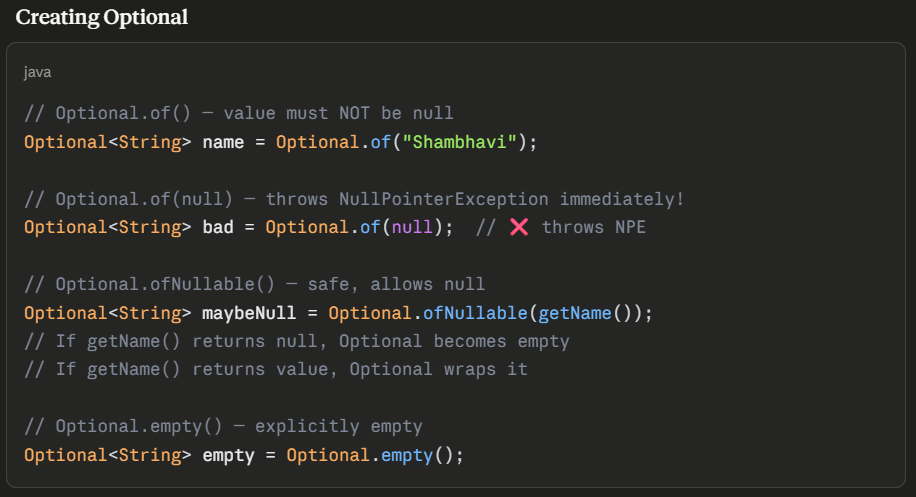
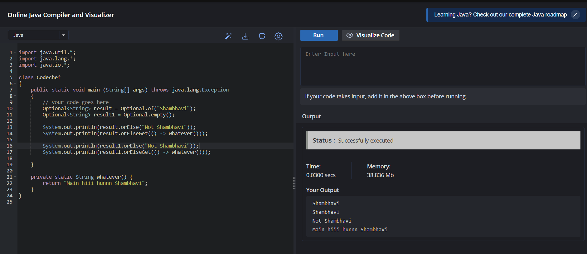
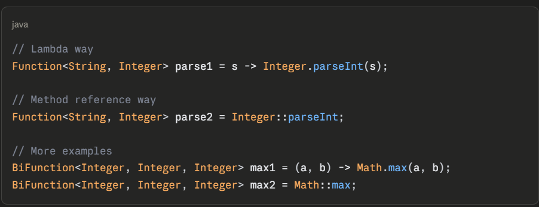
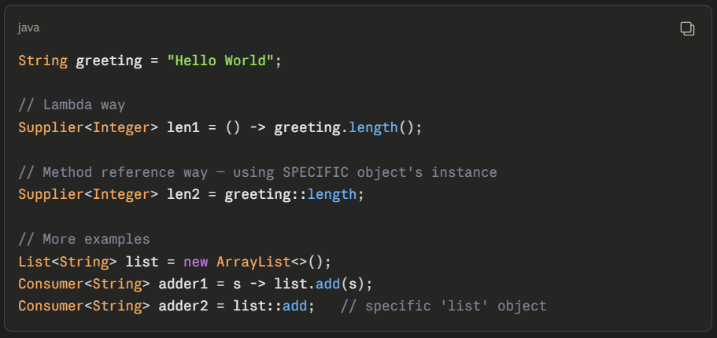
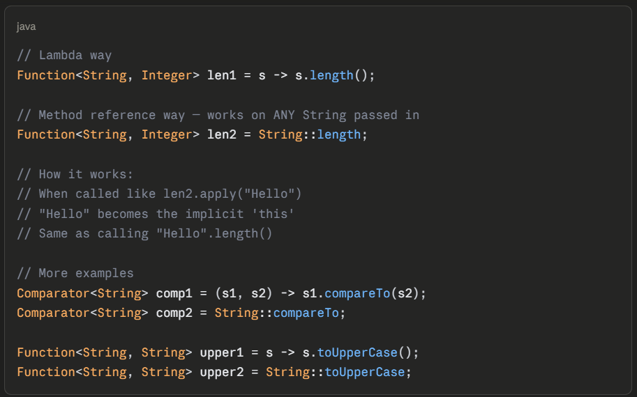
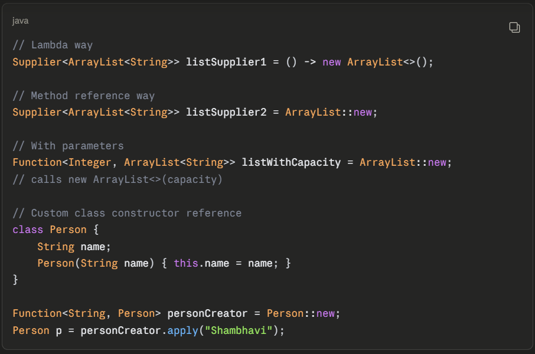
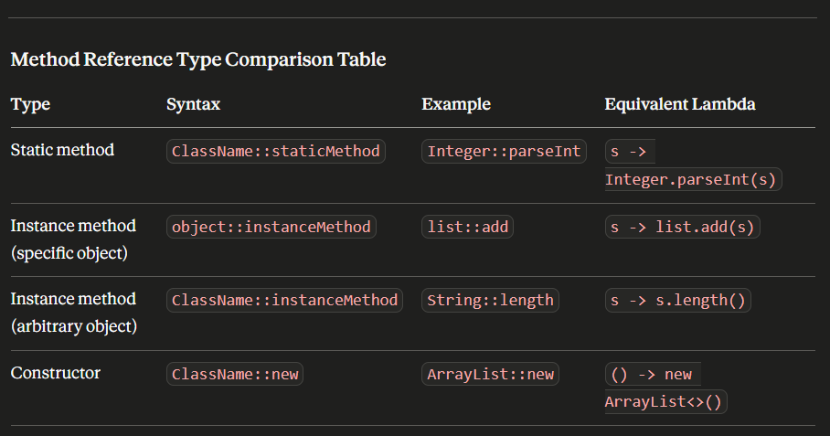

# Optional

* Java.util.Optional<T> is a single value container object introduced in Java 8, which may or may not contain a non-null value. 

* Why does Optional exist?

// THE PROBLEM — NullPointerException everywhere
public String getCity(User user) {
    return user.getAddress().getCity();
    // If address is null → NullPointerException!
}

// Traditional fix — ugly null checks
public String getCity(User user) {
    if (user != null) {
        Address address = user.getAddress();
        if (address != null) {
            return address.getCity();V
        }
    }
    return "Unknown";
}

* Optional was introduced in Java 8 to make "absence of value" EXPLICIT in the type system itself. Instead of returning null and hoping the caller checks for it, return Optional<T> which FORCES the caller to handle the empty case.

## Checking and Getting values:

Optional<String> name = Optional.of("Shambhavi");

// isPresent() — check if value exists
name.isPresent();      // true

// isEmpty() — opposite check (Java 11+)
name.isEmpty();        // false

// get() — DANGEROUS! throws exception if empty
name.get();             // "Shambhavi"
Optional.empty().get(); // ❌ throws NoSuchElementException!

// orElse() — provide default value
Optional<String> empty = Optional.empty();
empty.orElse("Default");        // "Default"
name.orElse("Default");         // "Shambhavi" (original used)

// orElseGet() — default value from Supplier (lazy)
empty.orElseGet(() -> "Computed Default");

// orElseThrow() — throw custom exception if empty
name.orElseThrow(() -> new RuntimeException("Name not found"));

## orElse() vs orElseGet() - Important Interview Trap !

// orElse() — ALWAYS evaluates the argument
// even if Optional has a value!
public String expensiveDefault() {
    System.out.println("Computing default...");
    return "Default";
}

Optional<String> name = Optional.of("Shambhavi");

name.orElse(expensiveDefault());
// PRINTS "Computing default..." 
// EVEN THOUGH name has a value!
// Because orElse() takes a VALUE not a Supplier
// Java must evaluate it first before passing

name.orElseGet(() -> expensiveDefault());
// DOES NOT PRINT anything!
// Because orElseGet() takes a SUPPLIER
// Only calls .get() on it if Optional is empty

## 🎯 KEY TAKEAWAY:
orElse()    → eager evaluation, always runs
orElseGet() → lazy evaluation, runs only if needed

Always prefer orElseGet() for 
expensive default computations!

### Example For Refernce: 

## Functional Methods on Optional

Optional<String> name = Optional.of("Shambhavi");

// ifPresent() — execute action if value exists
name.ifPresent(n -> System.out.println("Hello " + n));
// prints "Hello Shambhavi"

Optional.empty().ifPresent(n -> System.out.println("Hello " + n));
// prints NOTHING — action never runs

// ifPresentOrElse() — Java 9+, handle both cases
name.ifPresentOrElse(
    n -> System.out.println("Found: " + n),
    () -> System.out.println("Not found")
);

// map() — transform value if present
Optional<Integer> length = name.map(String::length);
// Optional[9]

Optional.empty().map(String::length);
// still Optional.empty() — map() does nothing on empty!

// filter() — keep value only if condition matches
Optional<String> longName = name.filter(n -> n.length() > 5);
// Optional[Shambhavi] — passes filter

Optional<String> shortCheck = name.filter(n -> n.length() > 20);
// Optional.empty() — fails filter, becomes empty

// flatMap() — for nested Optionals
Optional<Optional<String>> nested = Optional.of(Optional.of("data"));
Optional<String> flat = nested.flatMap(opt -> opt);

## Optional Anti-Patterns - (Common Interview Trick Questions) 

// ❌ ANTI-PATTERN 1: Using Optional as a field
class User {
    private Optional<String> name;  // BAD! Don't do this
}
// Optional should be used as RETURN TYPE only
// not as field type or method parameter

// ❌ ANTI-PATTERN 2: Calling get() without checking
Optional<String> name = Optional.empty();
String value = name.get();  // throws exception!

// ❌ ANTI-PATTERN 3: isPresent() + get() (defeats the purpose!)
if (name.isPresent()) {
    System.out.println(name.get());
}
// This is just null-check pattern again!
// Better:
name.ifPresent(System.out::println);

// ❌ ANTI-PATTERN 4: Optional<Collection>
Optional<List<String>> list;  // BAD!
// Just return an empty List instead of Optional<List>
// Collections have their own "empty" representation

# -------------------------------------------------------------- #

# Method References

* Method reference is shorthand syntax for a lambda expression that does NOTHING but call an existing method.

Operator used: ::  (double colon)

## 4 Types of Method References:

1. Type 1 - Static Method Reference

2. Type 2 - Instance Method Reference (Particular Object)

3. Type 3 - Instance Method Reference (Arbitrary Object of Particular Type)

4. Type 4 - Constructor Reference

## Method References in Streams - Real Usage

List<String> names = List.of("john", "alice", "bob");

// Using lambda
names.stream()
    .map(s -> s.toUpperCase())
    .forEach(s -> System.out.println(s));

// Using method references — cleaner!
names.stream()
    .map(String::toUpperCase)
    .forEach(System.out::println);

// Sorting with method reference
List<String> sorted = names.stream()
    .sorted(String::compareTo)
    .collect(Collectors.toList());

// Collecting to specific collection type
List<String> result = names.stream()
    .collect(Collectors.toCollection(ArrayList::new));

## Why use Method References over Lambda?

✅ More readable — clearly shows intent
✅ Less code — removes unnecessary lambda syntax
✅ No performance difference — both compile similarly

When NOT to use:
❌ When lambda has extra logic beyond just calling method
❌ When it makes code LESS readable (rare but possible)

# -------------------------------------------------------- #