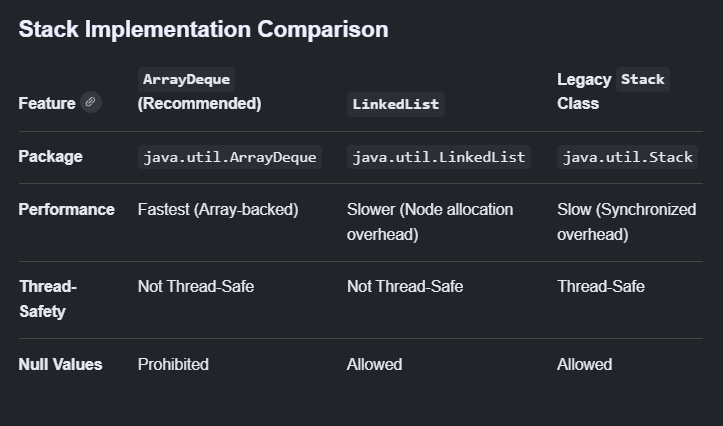
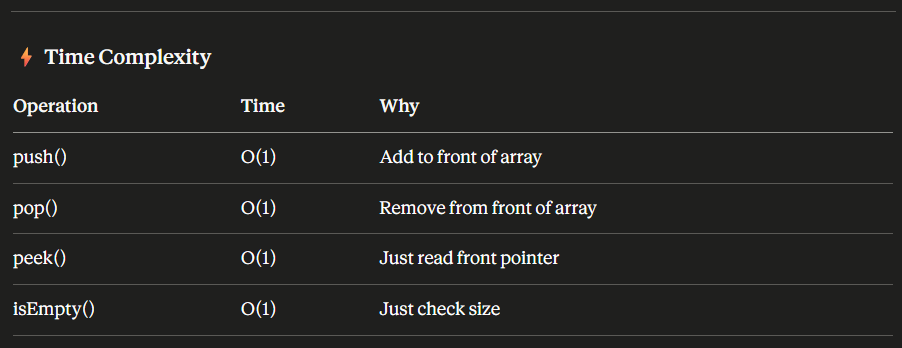

## Stack

* A stack is a linear data structure which works on Last-In-First-Out basis (LIFO). The last element in the stack is the first element removed. Java provides a legacy Java.utils.Stack that extends from Vector, making all the methods in here synchronized, and therefore it has performance overhead specially in all it's single threaded programs. Modern Java documents from Oracle recommends using Dequeue for Stack implementation for faster performances.
* ArrayDeque is used for Stack implementation.
* ArrayDeque is backed by Array

# Internal Implementation of Stack using Deque

Deque (Double Ended Queue) allows insert/remove from BOTH ends

     FRONT                    REAR
       ↕                        ↕
[ ] [ ] [ ] [ ] [ ] [ ] [ ] [ ]

For Stack behaviour we only use ONE end:
→ Always push to FRONT
→ Always pop from FRONT
→ This gives us LIFO behaviour

ArrayDeque internally uses:
→ A resizable circular array
→ head pointer (front)
→ tail pointer (rear)

Initial capacity: 16
Grows by: doubling when full

Visual:
index:  0   1   2   3   4   5...
array: [30] [20] [10] [  ] [  ] [  ]
        ↑
       head (top of stack)

Push 40:
index:  0   1   2   3   4   5...
array: [40] [30] [20] [10] [  ] [  ]
        ↑
       head moves left

# Deque Methods For Stack vs Queue
For STACK behaviour (LIFO) use:
→ push()  = addFirst()
→ pop()   = removeFirst()
→ peek()  = peekFirst()

For QUEUE behaviour (FIFO) use:
→ offer() = addLast()
→ poll()  = removeFirst()
→ peek()  = peekFirst()

# Internal Implementation of Stack using legacy class extended from Vector

Stack extends Vector
Vector internally uses a resizable array
Stack just adds 5 methods on top of Vector:
push(), pop(), peek(), empty(), search()

Visual:
Vector's internal array:
index: [0]  [1]  [2]  [3]  [4]...
        10   20   30   [  ] [  ]
                  ↑
              top (last element)

Push 40:
index: [0]  [1]  [2]  [3]  [4]...
        10   20   30   40   [  ]
                       ↑
                      top

Initial capacity: 10 (inherited from Vector)
Growth formula:   newCapacity = oldCapacity * 2
                  (Vector doubles, unlike ArrayList's 1.5x)

Every method in Vector is synchronized:
public synchronized E push(E item)
public synchronized E pop()
public synchronized E peek()

This means even single threaded programs
pay the cost of locking — unnecessary overhead

# Stack implementation using Array

Uses a fixed size array
Maintains a top pointer (index)
top = -1 means stack is empty

Initial state:
array: [ ][ ][ ][ ][ ]
top = -1

After push(10):
array: [10][ ][ ][ ][ ]
top = 0

After push(20):
array: [10][20][ ][ ][ ]
top = 1

After push(30):
array: [10][20][30][ ][ ]
top = 2

After pop():
array: [10][20][30][ ][ ]
top = 1        ↑
               top moved back
               30 still in array
               but logically removed

* Code Implementation:

class ArrayStack {
    private int[] array;
    private int top;
    private int capacity;

    // Constructor
    public ArrayStack(int capacity) {
        this.capacity = capacity;
        array = new int[capacity];
        top = -1;         // empty stack
    }

    // Push
    public void push(int value) {
        if (top == capacity - 1) {
            throw new RuntimeException("Stack Overflow!");
        }
        array[++top] = value;
    }

    // Pop
    public int pop() {
        if (isEmpty()) {
            throw new RuntimeException("Stack Underflow!");
        }
        return array[top--];
    }

    // Peek
    public int peek() {
        if (isEmpty()) {
            throw new RuntimeException("Stack is empty!");
        }
        return array[top];
    }

    // isEmpty
    public boolean isEmpty() {
        return top == -1;
    }

    // Size
    public int size() {
        return top + 1;
    }
}

// Usage
ArrayStack stack = new ArrayStack(5);
stack.push(10);
stack.push(20);
stack.push(30);
stack.peek();     // 30
stack.pop();      // 30
stack.size();     // 2

* Limitations of Array Stack:

❌ Fixed size — can't grow dynamically
❌ Stack Overflow if capacity exceeded
❌ Wastes memory if stack is mostly empty
✅ O(1) for all operations
✅ Simple and fast
✅ Cache friendly — contiguous memory

# Stack using LinkedList

Uses nodes connected by pointers
top always points to head node
Each node has: data + next pointer

Initial state:
top = null

After push(10):
top → [10|null]

After push(20):
top → [20|next] → [10|null]

After push(30):
top → [30|next] → [20|next] → [10|null]

After pop():
top → [20|next] → [10|null]
      30 is removed, top moves to 20

* Code Implementation:

class LinkedListStack {

    // Node class
    private class Node {
        int data;
        Node next;

        Node(int data) {
            this.data = data;
            this.next = null;
        }
    }

    private Node top;    // always points to top
    private int size;

    // Constructor
    public LinkedListStack() {
        top = null;
        size = 0;
    }

    // Push — add new node at head
    public void push(int value) {
        Node newNode = new Node(value);
        newNode.next = top;   // new node points to old top
        top = newNode;        // top moves to new node
        size++;
    }

    // Pop — remove head node
    public int pop() {
        if (isEmpty()) {
            throw new RuntimeException("Stack Underflow!");
        }
        int value = top.data;
        top = top.next;       // top moves to next node
        size--;
        return value;
    }

    // Peek — just read head data
    public int peek() {
        if (isEmpty()) {
            throw new RuntimeException("Stack is empty!");
        }
        return top.data;
    }

    // isEmpty
    public boolean isEmpty() {
        return top == null;
    }

    // Size
    public int size() {
        return size;
    }
}

// Usage
LinkedListStack stack = new LinkedListStack();
stack.push(10);
stack.push(20);
stack.push(30);
stack.peek();     // 30
stack.pop();      // 30
stack.size();     // 2

* My query: How is top.next pointing to the previous element to pop the top most element? Shouldn't it be ideally previous?

🤔 Your Confusion is Valid — Let's Clear It Up
You're thinking of it like this:
Push order: 10 → 20 → 30

Intuitively feels like:
[10] → [20] → [30]
                ↑
               top

So to go back, top should have a
"previous" pointer going backwards

✅ But Here's How It Actually Works
The key insight:
In LinkedList Stack, new nodes are 
ALWAYS inserted at the HEAD (front)
NOT at the tail (end)!

So the list is actually built in REVERSE:

Step by Step Visualization:
push(10):
top → [10|null]
       ↑
      HEAD

push(20):
newNode[20].next = top (which is 10)
top = newNode(20)

top → [20|next] → [10|null]
       ↑
      HEAD
      (20 is now in front of 10)

push(30):
newNode[30].next = top (which is 20)
top = newNode(30)

top → [30|next] → [20|next] → [10|null]
       ↑
      HEAD
      (30 is now in front of 20)

🎯 So Why Does top.next Work For Pop?
Current state:
top → [30|next] → [20|next] → [10|null]

pop() does:
value = top.data        // gets 30
top = top.next          // top moves to 20

New state:
top → [20|next] → [10|null]

Because next points FORWARD in the list

but BACKWARD in push order:
"next" in memory:    30 → 20 → 10
"push order":        10   20   30

They are OPPOSITE directions!
So top.next naturally gives you
the previously pushed element ✅

# --------------------------------------------------------------------------------------- #