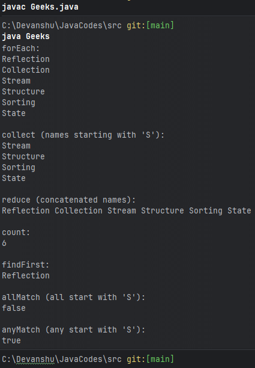

# Functional Interface - The Foundation

An interface with EXACTLY ONE abstract method
Can have multiple default/static methods

Annotated with @FunctionalInterface (optional but recommended)
Enables lambda expressions to work

## Built-In Functional Interfaces: 

// 1. Function<T, R> — takes T, returns R
Function<Integer, Integer> square = x -> x * x;
square.apply(5);    // 25

// 2. Predicate<T> — takes T, returns boolean
Predicate<Integer> isEven = x -> x % 2 == 0;
isEven.test(4);     // true

// 3. Consumer<T> — takes T, returns nothing
Consumer<String> print = s -> System.out.println(s);
print.accept("Hello");   // prints Hello

// 4. Supplier<T> — takes nothing, returns T
Supplier<String> greet = () -> "Hello World";
greet.get();        // "Hello World"

// 5. BiFunction<T, U, R> — takes two inputs, returns R
BiFunction<Integer, Integer, Integer> add = (a, b) -> a + b;
add.apply(3, 4);    // 7

// 6. UnaryOperator<T> — takes T, returns T (same type)
UnaryOperator<Integer> increment = x -> x + 1;
increment.apply(5); // 6

// 7. BinaryOperator<T> — takes two T, returns T
BinaryOperator<Integer> multiply = (a, b) -> a * b;
multiply.apply(3, 4);  // 12

## Custom Functional Interfaces:

@FunctionalInterface
interface Calculator {
    int calculate(int a, int b);
}

Calculator add = (a, b) -> a + b;
Calculator multiply = (a, b) -> a * b;

System.out.println(add.calculate(5, 3));        // 8
System.out.println(multiply.calculate(5, 3));   // 15

# ------------------------------------------------------------- #

# Streams

* Stream was introduced in Java 8 to simplify processing of Collections and data. It provides a modern and efficient way to perform operations on a group of object using functional programming approach. 
* Allows processing of data without modifying the original collection.
* Supports parallel processing to improve performance on larger datasets.
* Reduces the need for lengthy loops and temporary variables in code.

## Java Stream Features

* A stream is not a data structure, it takes input from Collections such as Arraylist.
* Streams do not modify the original data, they only produce results using their own methods.
* Intermediate operations (like map,filter) are lazy and return stream so you can map them together.
* A terminal operation (like collect, foreach and count) ends the stream and gives the final result.

A stream is NOT a data structure
It does NOT store data
It's a PIPELINE that processes data
from a source (Collection, Array etc)

Streams are:
✅ Lazy — operations don't execute until terminal operation
✅ Functional — doesn't modify original source
✅ Can be consumed only ONCE

## Stream Pipeline Structure:
SOURCE → INTERMEDIATE OPERATIONS → TERMINAL OPERATION

List<Integer> nums = List.of(1,2,3,4,5);

nums.stream()              // SOURCE
    .filter(x -> x % 2 == 0)   // INTERMEDIATE
    .map(x -> x * x)            // INTERMEDIATE
    .collect(Collectors.toList());  // TERMINAL

## Creating Streams:

// From Collection
List<Integer> list = List.of(1, 2, 3);
Stream<Integer> stream1 = list.stream();

// From Array
int[] arr = {1, 2, 3};
IntStream stream2 = Arrays.stream(arr);

// Using Stream.of()
Stream<String> stream3 = Stream.of("a", "b", "c");

// Infinite stream (use limit!)
Stream<Integer> infinite = Stream.iterate(1, x -> x + 1);
infinite.limit(5).forEach(System.out::println);  // 1 2 3 4 5

## Internal Working -- How streams actually execute?

KEY CONCEPT: Streams are LAZY

nums.stream()
    .filter(x -> {
        System.out.println("filtering " + x);
        return x % 2 == 0;
    })
    .map(x -> {
        System.out.println("mapping " + x);
        return x * x;
    })
    .collect(Collectors.toList());

// OUTPUT (notice the ORDER):
// filtering 1
// filtering 2
// mapping 2
// filtering 3
// filtering 4
// mapping 4
// filtering 5
...

// WHY? Stream processes ONE ELEMENT 
// through ENTIRE pipeline before moving to next!
// NOT filter-all-then-map-all

* Why this matters?

Without laziness:
filter ALL elements → creates new list
map ALL elements    → creates another list
= 2 passes, 2 intermediate lists, wasteful!

With laziness (actual Stream behaviour):
each element flows through filter→map→collect
= 1 pass, no intermediate lists, efficient!

## Different types of operations on stream:

1. Intermediate Operations:
Intermediate operations are the operations that have multiple methods chained in a row.

Characteristics of Intermediate Operations:
* Methods are chained together.
* Transforms a stream into another stream.
* It enables the concept of filtering where one method filters data and passes it into another method.

For Example:-> map(), filter(), sorted(), flatMap(), distinct(), peek().

#### ////// Code
import java.util.Arrays;
import java.util.HashSet;
import java.util.List;
import java.util.Set;
import java.util.stream.Collectors;

public class StreamIntermediateOperationsExample {
    public static void main(String[] args) {
        // List of lists of names
        List<List<String>> listOfLists = Arrays.asList(
            Arrays.asList("Reflection", "Collection", "Stream"),
            Arrays.asList("Structure", "State", "Flow"),
            Arrays.asList("Sorting", "Mapping", "Reduction", "Stream")
        );

        // Create a set to hold intermediate results
        Set<String> intermediateResults = new HashSet<>();

        // Stream pipeline demonstrating various intermediate operations
        List<String> result = listOfLists.stream()
            .flatMap(List::stream)              
            .filter(s -> s.startsWith("S"))      
            .map(String::toUpperCase)          
            .distinct()                          
            .sorted()                            
            .peek(s -> intermediateResults.add(s))
            .collect(Collectors.toList());      

        // Print the intermediate results
        System.out.println("Intermediate Results:");
        intermediateResults.forEach(System.out::println);

        // Print the final result
        System.out.println("Final Result:");
        result.forEach(System.out::println);
    }
}

#### ////// Output
Intermediate Results:
STRUCTURE
STREAM
STATE
SORTING
Final Result:
SORTING
STATE
STREAM
STRUCTURE

#### ////// Explaination ->
* The listOfLists is created as a list containing other lists of strings.
* flatMap(List::stream): Flattens the nested lists into a single stream of strings.
* filter(s -> s.startsWith("S")): Filters the strings to only include those that start with "S".
* map(String::toUpperCase): Converts each string in the stream to uppercase.
* distinct(): Removes any duplicate strings.
* sorted(): Sorts the resulting strings alphabetically.
* peek(...): Adds each processed element to the intermediateResults set for intermediate inspection.
* collect(Collectors.toList()): Collects the final processed strings into a list called result.

2. Terminal Operations:
These operations return the final result and end the stream processing. They do not process any further.

For Example:-> collect(), forEach(), reduce(), count(), findFirst(), allMatch(), anyMatch()

#### ////// Code

import java.util.*;
import java.util.stream.Collectors;

public class StreamTerminalOperationsExample {
    public static void main(String[] args) {
        // Sample data
        List<String> names = Arrays.asList(
            "Reflection", "Collection", "Stream",
            "Structure", "Sorting", "State"
        );

        // forEach: Print each name
        System.out.println("forEach:");
        names.stream().forEach(System.out::println);

        // collect: Collect names starting with 'S' into a list
        List<String> sNames = names.stream()
                                   .filter(name -> name.startsWith("S"))
                                   .collect(Collectors.toList());
        System.out.println("\ncollect (names starting with 'S'):");
        sNames.forEach(System.out::println);

        // reduce: Concatenate all names into a single string
        String concatenatedNames = names.stream().reduce(
            "",
            (partialString, element) -> partialString + " " + element
        );
        System.out.println("\nreduce (concatenated names):");
        System.out.println(concatenatedNames.trim());

        // count: Count the number of names
        long count = names.stream().count();
        System.out.println("\ncount:");
        System.out.println(count);

        // findFirst: Find the first name
        Optional<String> firstName = names.stream().findFirst();
        System.out.println("\nfindFirst:");
        firstName.ifPresent(System.out::println);

        // allMatch: Check if all names start with 'S'
        boolean allStartWithS = names.stream().allMatch(
            name -> name.startsWith("S")
        );
        System.out.println("\nallMatch (all start with 'S'):");
        System.out.println(allStartWithS);

        // anyMatch: Check if any name starts with 'S'
        boolean anyStartWithS = names.stream().anyMatch(
            name -> name.startsWith("S")
        );
        System.out.println("\nanyMatch (any start with 'S'):");
        System.out.println(anyStartWithS);
    }
}

#### ////// Output:

#### ////// Explaination: 
Explanation:

* The names list is created with sample strings.
* forEach: Prints each name in the list.
* collect: Filters names starting with 'S' and collects them into a new list.
* reduce: Concatenates all names into a single string.
* count: Counts the total number of names.
* findFirst: Finds and prints the first name in the list.
* allMatch: Checks if all names start with 'S'.
* anyMatch: Checks if any name starts with 'S'.

* Note: Intermediate operations in a stream (like filter and map) are lazy and process elements one by one only when a terminal operation (like findFirst) is invoked, allowing early termination and efficient execution.

## Benefit of Java Stream
There are some benefits because of which we use Stream in Java as mentioned below:

* No storage
* Pipeline of functions
* Laziness
* Can be infinite
* Can be parallelized for large datasets (may not always improve performance)
* More readable and concise than loops
* Can be created from collections, arrays, files, methods, IntStream, etc.

## Streams are widely used in modern Java applications for:

* Data Processing
* For processing JSON/XML responses
* For database Operations
* Concurrent Processing

## Time Complexity:

Stream operations themselves don't change
Big-O complexity of underlying operations
filter/map are still O(n)
sorted is still O(n log n)

The benefit of Streams is READABILITY
and FUNCTIONAL style, not performance gains
(sometimes Streams can be slightly slower
due to lambda overhead for simple operations)

# ------------------------------------------------------------- #

# Lambda

* Java Lambda expressions were introduced in Java 8. They are concise, anonymous functions that allows us to treat functions as method arguments. 
* They significantly reduce boiler plate code by providing a clear and compact way of implementing Funtional Interfaces (Interfaces with only one abstract method).

## Syntax Evolution:

// Before Java 8 — Anonymous class
Runnable r1 = new Runnable() {
    @Override
    public void run() {
        System.out.println("Running");
    }
};

// Java 8 — Lambda expression
Runnable r2 = () -> System.out.println("Running");

## Lambda Syntax Variations:

// No parameters
Runnable r = () -> System.out.println("No params");

// One parameter — parentheses optional
Consumer<String> c1 = s -> System.out.println(s);
Consumer<String> c2 = (s) -> System.out.println(s);

// Multiple parameters
BiFunction<Integer, Integer, Integer> add = (a, b) -> a + b;

// Multiple statements — need braces and return
Function<Integer, Integer> square = (x) -> {
    int result = x * x;
    return result;
};

// Type can be explicit (rarely used, type inference preferred)
BiFunction<Integer, Integer, Integer> add2 = (Integer a, Integer b) -> a + b;

## Why Lambda Works - Behind the Scenes?
Lambda expressions are syntactic sugar
The JVM converts them to functional interface
implementations at compile time using
invokedynamic bytecode instruction

This is more efficient than anonymous classes
because no extra .class file is generated
for every lambda usage!

## Method References: 

// Lambda way
Function<String, Integer> length1 = s -> s.length();

// Method reference way — cleaner!
Function<String, Integer> length2 = String::length;

// Static method reference
Function<String, Integer> parse = Integer::parseInt;

// Instance method reference (specific object)
String str = "Hello";
Supplier<Integer> len = str::length;

// Constructor reference
Supplier<ArrayList<String>> listSupplier = ArrayList::new;

# ------------------------------------------------------------- #